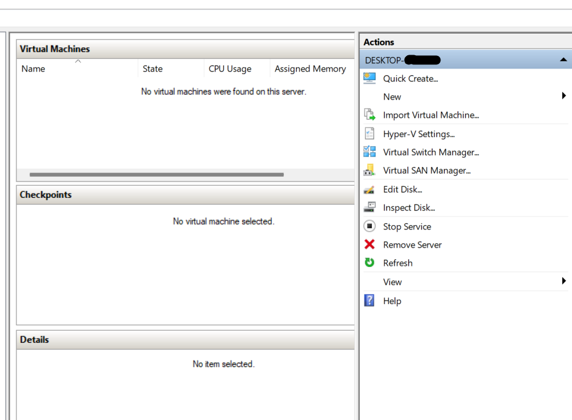
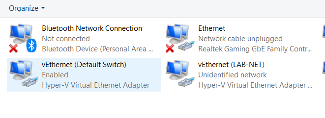
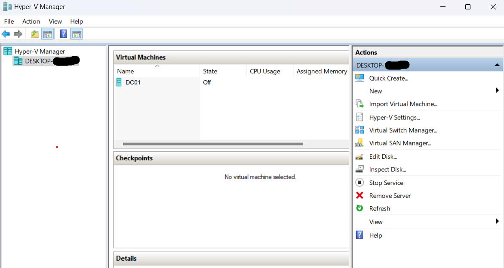
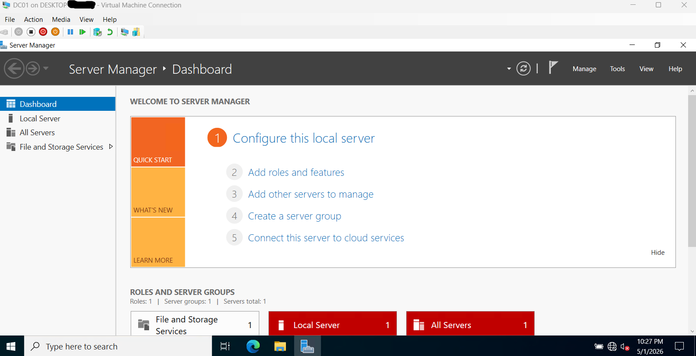
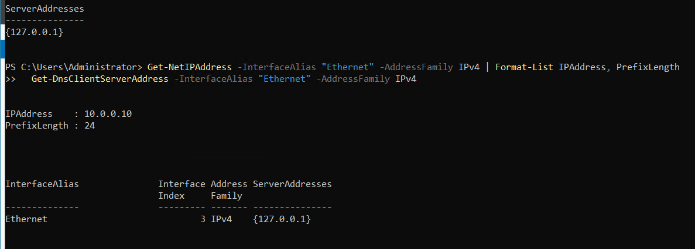
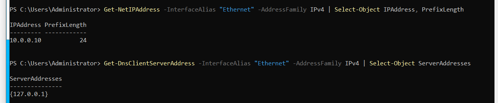

# Part 1 - Hyper-V + Windows Server 2022

> Provisioning the foundation: Hyper-V host setup, internal virtual switch, Windows Server 2022 VM, and baseline configuration ready for Active Directory promotion.

---

## Objective

Build a Windows Server 2022 virtual machine on Hyper-V that is correctly named, statically addressed, and DNS-self-referencing - the prerequisites for promoting it to a Domain Controller in Part 2.

By the end of Part 1, the server `DC01` is running on an isolated virtual network, ready to host AD DS, DNS, and DHCP roles.

---

## Lab State After Part 1

```
+---------------------------------------------------------+
|              Hyper-V Host (Windows 11 Pro)              |
|                                                         |
|  +----------------------+                               |
|  |  DC01                |                               |
|  |  Windows Server 2022 |                               |
|  |  Static: 10.0.0.10   |                               |
|  |  DNS:    127.0.0.1   |                               |
|  |  Workgroup           |  <- AD not installed yet       |
|  +----------------------+                               |
|                  Internal vSwitch: LAB-NET              |
+---------------------------------------------------------+
```

---

## Steps Performed

### 1.1 - Enable Hyper-V on the Windows 11 Pro host

Hyper-V is included with Windows 11 Pro but disabled by default. Enabled the feature via the Optional Features dialog (`OptionalFeatures.exe` -> Hyper-V -> both sub-items checked) and rebooted.

After reboot, Hyper-V Manager is accessible from the Start menu:



The host appears in the left pane with an empty Virtual Machines list, confirming Hyper-V is running and the management console can connect to it.

---

### 1.2 - Create internal virtual switch `LAB-NET`

A virtual switch is the network the lab VMs will live on. **Internal** type is intentional - VMs can communicate with each other and with the host, but cannot reach the home network or the public internet. This isolates the lab so that a misconfigured DC (running DHCP/DNS) cannot affect production systems.

```powershell
New-VMSwitch -Name "LAB-NET" -SwitchType Internal -Notes "Isolated lab network for IT Helpdesk Lab 2026"
```

Verify:

```powershell
Get-VMSwitch | Where-Object { $_.Name -eq "LAB-NET" }
```

The host receives a corresponding virtual NIC named `vEthernet (LAB-NET)`, visible in `ncpa.cpl`. This is the host's interface into the lab network - it lets PowerShell remoting and file copies work later without external tools.



---

### 1.3 - Download Windows Server 2022 evaluation ISO

Source: [Microsoft Evaluation Center](https://www.microsoft.com/en-us/evalcenter/evaluate-windows-server-2022). The 180-day evaluation is the full Standard/Datacenter edition with no functional restrictions.

ISO organized into a permanent location to keep the project tidy:

```powershell
New-Item -ItemType Directory -Path "D:\HyperV\ISOs", "D:\HyperV\VMs" -Force
Move-Item "$HOME\Downloads\*Server*2022*.iso" "D:\HyperV\ISOs\"
```

Final path: `D:\HyperV\ISOs\SERVER_EVAL_x64FRE_en-us.iso`

---

### 1.4 - Create the `DC01` virtual machine

Created via Hyper-V Manager with these specifications:

| Setting | Value | Rationale |
|---------|-------|-----------|
| Name | `DC01` | Industry-standard naming for the first Domain Controller |
| Generation | 2 | UEFI boot, modern firmware, required for current security features |
| Memory | 4 GB startup, dynamic up to 8 GB | AD DS recommends 4 GB minimum; dynamic memory frees host RAM when idle |
| Virtual Processors | 2 | Sufficient for AD/DNS/DHCP at lab scale |
| Hard Disk | 60 GB dynamically expanding | Server 2022 uses ~15 GB; dynamic disk only consumes space as written |
| Network | Connected to `LAB-NET` | Isolated from home network |
| Boot ISO | `D:\HyperV\ISOs\SERVER_EVAL_x64FRE_en-us.iso` | Mounted as virtual DVD for first boot |

PowerShell equivalent (the way it would be done in production / via automation):

```powershell
$vmName  = "DC01"
$vmPath  = "D:\HyperV\VMs"
$vhdPath = "D:\HyperV\VMs\$vmName\Virtual Hard Disks\$vmName.vhdx"
$isoPath = "D:\HyperV\ISOs\SERVER_EVAL_x64FRE_en-us.iso"

New-VM -Name $vmName `
       -Path $vmPath `
       -Generation 2 `
       -MemoryStartupBytes 4GB `
       -NewVHDPath $vhdPath `
       -NewVHDSizeBytes 60GB `
       -SwitchName "LAB-NET"

Set-VMMemory -VMName $vmName -DynamicMemoryEnabled $true -MinimumBytes 1GB -MaximumBytes 8GB
Set-VMProcessor -VMName $vmName -Count 2
Add-VMDvdDrive -VMName $vmName -Path $isoPath
```



---

### 1.5 - Install Windows Server 2022 Standard (Desktop Experience)

Booted DC01 from the mounted ISO and walked the standard Windows Server installer. Selected **Standard Edition with Desktop Experience** (the GUI version - Server Core is deliberately not used because the lab requires the GUI for tooling like Server Manager, ADUC, and GPMC).

Set the Administrator password during the out-of-box experience (OOBE) and reached the Server Manager dashboard on first login.



---

### 1.6 - Rename the computer to `DC01`

The default Windows-generated computer name (`WIN-XXXXXXXXX`) was changed to `DC01` *before* AD promotion. Renaming a server **after** it has been promoted to a DC is supported but introduces replication and DNS complications. Standard practice is to finalize the hostname first.

```powershell
Rename-Computer -NewName "DC01" -Force
```

The rename is queued until the next reboot. Verified post-reboot:

```powershell
hostname
# DC01
```


---

### 1.7 - Configure static IP on LAB-NET adapter

A Domain Controller must have a static IP. AD relies on stable DNS records that resolve to predictable addresses; if the DC's IP changes, every domain-joined machine fails to authenticate until DNS catches up. DHCP for a DC is never appropriate.

The first DC in a forest is its own DNS server, so it points DNS at the loopback address `127.0.0.1`. This becomes important in Part 2 when the AD DS role installs DNS on this machine - the server can resolve its own records before any external DNS is configured.

```powershell
# Identify the lab adapter
Get-NetAdapter

# Apply static IP and DNS
New-NetIPAddress -InterfaceAlias "Ethernet" `
                 -IPAddress 10.0.0.10 `
                 -PrefixLength 24

Set-DnsClientServerAddress -InterfaceAlias "Ethernet" `
                           -ServerAddresses 127.0.0.1
```

No default gateway is set. The lab network has no internet egress yet (LAB-NET is an Internal switch with no NAT); a gateway will be added when ICS/NAT is configured in a later phase if needed for Windows Update.



---

### 1.8 - Reboot and verify

```powershell
Restart-Computer -Force
```

After reboot, all three configuration changes were verified in a single PowerShell session:

```powershell
hostname
# DC01

Get-NetIPAddress -InterfaceAlias "Ethernet" -AddressFamily IPv4 |
    Select-Object IPAddress, PrefixLength
# IPAddress  PrefixLength
# ---------  ------------
# 10.0.0.10            24

Get-DnsClientServerAddress -InterfaceAlias "Ethernet" -AddressFamily IPv4 |
    Select-Object ServerAddresses
# ServerAddresses
# ---------------
# {127.0.0.1}
```



---

## Lessons Learned / Issues Resolved

### Issue 1 - Bootloader fail / PXE boot loop

**Symptom:** On first VM start, the install did not begin. Instead, the VM displayed "Start PXE over IPv4" and hung trying to network-boot.

**Diagnosis:** The DVD drive was either not the first device in the boot order, or Secure Boot rejected the eval ISO's bootloader signature. Either condition causes Hyper-V to fall through to the next boot device - the network adapter - which has no PXE server to respond.

**Resolution:**
1. Powered the VM off (`Stop-VM -Name DC01 -TurnOff`)
2. Set the boot order so DVD Drive is first (Hyper-V Manager -> DC01 -> Settings -> Firmware -> Move Up)
3. Disabled Secure Boot (Settings -> Security -> uncheck **Enable Secure Boot**)
4. Started the VM and pressed a key promptly at the "Press any key to boot from CD or DVD..." prompt

After the fix the installer launched normally. Secure Boot can be re-enabled after install if desired; for a lab VM the default-off configuration is acceptable.

**Why this matters:** Boot order and Secure Boot are two of the most common reasons new Hyper-V Gen 2 VMs fail to install. Knowing to check both saves significant time.

---

### Issue 2 - `Restart-Computer` not recognized in CMD

**Symptom:**
```
'Restart-Computer' is not recognized as an internal or external command,
operable program or batch file.
```

**Cause:** `Restart-Computer` is a PowerShell cmdlet. The active shell was Command Prompt, which only understands `cmd.exe` built-ins.

**Resolution:** Either switch shells (`powershell` from CMD launches a nested PS session) or use the CMD-native equivalent:

```cmd
shutdown /r /t 0
```

**Takeaway:** CMD and PowerShell are both present on every modern Windows install and are not interchangeable. Modern administration is PowerShell-first; CMD remains for legacy scripts and quick tasks.

---

## Skills Demonstrated

- Hyper-V feature enablement and Manager usage
- Virtual switch design (Internal vs External vs Private - and why)
- Hyper-V Generation 2 VM provisioning
- Windows Server 2022 unattended OS installation
- PowerShell-driven post-install configuration:
  - `Rename-Computer`
  - `New-NetIPAddress` / `Set-DnsClientServerAddress`
  - `Get-NetAdapter` / `Get-NetIPAddress` / `Get-DnsClientServerAddress`
- Boot firmware troubleshooting (Secure Boot, boot order, PXE fallback behavior)
- Standard server-naming and IP-allocation conventions

---

## What's Next

[Part 2 - Active Directory + PowerShell Promotion](../part-02-active-directory/) - Install the AD DS role, promote `DC01` to the first Domain Controller in a new forest (`mandolab.local`), and verify the domain is healthy.
