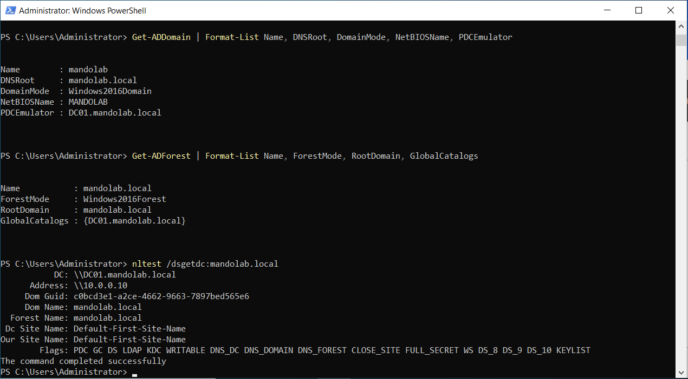
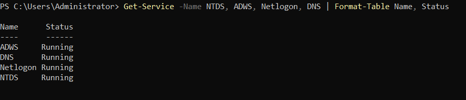

# Part 2 - Active Directory + PowerShell Promotion

> Installing the Active Directory Domain Services (AD DS) role on `DC01`, promoting it to the first Domain Controller in a new forest, and verifying domain health.

**Status:** Complete - `mandolab.local` forest is live, DC01 is a fully operational Domain Controller.

---

## Objective

Transform `DC01` from a standalone Windows Server into the first Domain Controller of a new Active Directory forest named `mandolab.local`. After Part 2:

- A new AD forest and domain (`mandolab.local`) exists
- `DC01` hosts AD DS, DNS, and Kerberos KDC services
- The domain database (`NTDS.dit`) and `SYSVOL` share are operational
- Domain-joined clients (added in Part 4) will authenticate against this DC

---

## Lab State After Part 2

```
+---------------------------------------------------------+
|              Hyper-V Host (Windows 11 Pro)              |
|                                                         |
|  +----------------------+                               |
|  |  DC01                |                               |
|  |  Forest: mandolab.local                              |
|  |  Domain: mandolab.local                              |
|  |  Roles:  AD DS, DNS, KDC, GC                         |
|  |  Static: 10.0.0.10                                   |
|  |  DNS:    127.0.0.1                                   |
|  +----------------------+                               |
|                  Internal vSwitch: LAB-NET              |
+---------------------------------------------------------+
```

---

## Conceptual Background

### What Active Directory actually is

Active Directory is three things stacked on top of each other:

1. **A specialized database** (`NTDS.dit`) that stores users, computers, groups, group policies, and their attributes.
2. **A protocol stack** that exposes that database over the network: LDAP for queries, Kerberos for authentication, DNS for service discovery, SMB for file replication.
3. **A logical hierarchy** organizing objects into forests, domains, and organizational units (OUs).

### Forest vs Domain vs OU

| Term | What it is | Real-world analogy |
|------|-----------|---------------------|
| **Forest** | The top-level security and replication boundary. All domains in a forest share a common schema and global catalog. | A whole company |
| **Domain** | A namespace inside the forest with its own DCs and replication. | A division or subsidiary |
| **OU** | A container inside a domain used to organize objects and apply Group Policy. | A department |

This lab uses a **single-forest, single-domain** model - the most common configuration in small/mid businesses.

### Why `mandolab.local`

- The lab is fully isolated (no public DNS), so no real domain is required.
- Microsoft historically recommended `.local` for AD; modern guidance prefers a real owned subdomain (`corp.example.com`), but `.local` remains acceptable for isolated labs and is what the majority of small business AD environments still use.
- Renaming a domain post-deployment is painful, so the name was chosen with longevity in mind.

---

## Steps Performed

### 2.1 - Verify prerequisites

Before installing AD DS, confirmed `DC01` is in the correct baseline state from Part 1: hostname matches, static IP is set, DNS points to loopback.

```powershell
hostname
# DC01

Get-NetIPAddress -InterfaceAlias "Ethernet" -AddressFamily IPv4 |
    Select-Object IPAddress, PrefixLength
# IPAddress  PrefixLength
# ---------  ------------
# 10.0.0.10            24

Get-DnsClientServerAddress -InterfaceAlias "Ethernet" -AddressFamily IPv4 |
    Select-Object ServerAddresses
# ServerAddresses
# ---------------
# {127.0.0.1}
```

A stable hostname, static IP, and self-referential DNS are all hard requirements for AD promotion. Promoting a server with DHCP or a missing DNS pointer fails in confusing ways - it is worth catching here rather than mid-promotion.

---

### 2.2 - Install the AD DS role

In Windows Server, "roles" are major capabilities the OS can take on (file server, web server, Domain Controller, etc.). Installing the **AD-Domain-Services** role adds the binaries and management tools needed to *become* a Domain Controller. It does not promote the server on its own - that is Step 2.3.

```powershell
Install-WindowsFeature -Name AD-Domain-Services -IncludeManagementTools
```

The `-IncludeManagementTools` flag is important. Without it, only the role binaries install - no GUI tools (Active Directory Users and Computers, Active Directory Sites and Services, Group Policy Management Console) and no `ActiveDirectory` PowerShell module. Always install with management tools on a DC.

Verify install:

```powershell
Get-WindowsFeature -Name AD-Domain-Services | Format-List Name, InstallState
# Name         : AD-Domain-Services
# InstallState : Installed
```


The state transitions from `Available` (before) to `Installed` (after). At this point the server has the *capability* to become a DC but has not been promoted - it is still in the workgroup `WORKGROUP`.

---

### 2.3 - Promote DC01 to a Domain Controller

This is the action that creates the `mandolab.local` forest and makes DC01 the first DC in it. A single PowerShell call performs the full promotion: builds the AD database, creates the SYSVOL share, installs DNS, configures Kerberos, and reboots the server.

```powershell
Install-ADDSForest `
    -DomainName "mandolab.local" `
    -DomainNetbiosName "MANDOLAB" `
    -ForestMode "WinThreshold" `
    -DomainMode "WinThreshold" `
    -InstallDns `
    -NoRebootOnCompletion:$false `
    -Force:$true
```

| Parameter | Value | Purpose |
|-----------|-------|---------|
| `-DomainName` | `mandolab.local` | Full DNS name of the new domain |
| `-DomainNetbiosName` | `MANDOLAB` | Legacy NetBIOS name, used in `MANDOLAB\username` style logins |
| `-ForestMode` / `-DomainMode` | `WinThreshold` | Windows Server 2016 functional level (current maximum even on Server 2022) |
| `-InstallDns` | flag | Auto-installs DNS Server role and creates the AD-integrated DNS zone |
| `-NoRebootOnCompletion:$false` | flag | Reboot automatically when promotion completes |
| `-Force:$true` | flag | Skip interactive confirmation prompts |

**DSRM password:** During promotion, PowerShell prompts for a Directory Services Restore Mode (DSRM) password. This is separate from the Administrator password and is only used to boot the DC into safe mode for AD database recovery. A strong, documented password was set during this step.

After promotion completed, `DC01` rebooted automatically. On next login the account context changed from `DC01\Administrator` (local) to `MANDOLAB\Administrator` (domain) - the first visible confirmation that the promotion succeeded.

---

### 2.4 - Verify domain health

Three commands provide a complete health snapshot of the new domain. Each one tests a different layer: directory service, forest topology, and DNS/locator.

```powershell
Get-ADDomain | Format-List Name, DNSRoot, DomainMode, NetBIOSName, PDCEmulator
Get-ADForest | Format-List Name, ForestMode, RootDomain, GlobalCatalogs
nltest /dsgetdc:mandolab.local
```



**What this proves:**

- **`Get-ADDomain`** confirms the domain object exists, the functional level is `Windows2016Domain`, and the PDC emulator FSMO role is held by `DC01.mandolab.local`.
- **`Get-ADForest`** confirms the forest `mandolab.local` exists at functional level `Windows2016Forest`, and `DC01` is the Global Catalog server.
- **`nltest /dsgetdc`** is the gold-standard "DC locator" test. The returned flags indicate every critical service is operational:

| Flag | Meaning |
|------|---------|
| `PDC` | PDC Emulator role active |
| `GC` | Global Catalog active |
| `DS` | Directory Service running |
| `LDAP` | LDAP queries answered |
| `KDC` | Kerberos Key Distribution Center responding |
| `WRITABLE` | Read-write DC (not RODC) |
| `DNS_DC`, `DNS_DOMAIN`, `DNS_FOREST` | All AD-integrated DNS records registered |

`The command completed successfully` is the explicit success message from `nltest`.

---

### 2.5 - Confirm critical services are running

Beyond the domain object existing, the underlying Windows services must be running for AD to actually function. Four services are the minimum for a healthy DC:

```powershell
Get-Service -Name NTDS, ADWS, Netlogon, DNS | Format-Table Name, Status
```

| Service | Role |
|---------|------|
| `NTDS` | Active Directory Domain Services - the AD database engine |
| `ADWS` | Active Directory Web Services - PowerShell `ActiveDirectory` module backend |
| `Netlogon` | Maintains the secure channel between the DC and other domain members |
| `DNS` | DNS Server - serves the `mandolab.local` zone |



All four services show `Running` status. If any one of these were stopped, AD would be partially or fully nonfunctional - making this a useful go-to triage command for any DC issue in production.

---

## Issues Resolved

### Issue - `Install-ADDSForest` parameter validation errors

**Symptom:** First two attempts to run `Install-ADDSForest` failed prerequisites check with errors about `CreateDNSDelegation` and `DataBasePath` parameters being unrecognized, despite documentation listing both as valid.

**Diagnosis:** The `-CreateDnsDelegation` parameter is only valid when delegating into an existing parent DNS zone. Since `.local` has no public DNS hierarchy to delegate from, the parameter is rejected. The path parameters (`-DatabasePath`, `-LogPath`, `-SysvolPath`) appeared to have casing/version sensitivity in the installed PowerShell module.

**Resolution:** Removed all of the optional path and delegation parameters and let the installer use defaults:

```powershell
Install-ADDSForest `
    -DomainName "mandolab.local" `
    -DomainNetbiosName "MANDOLAB" `
    -ForestMode "WinThreshold" `
    -DomainMode "WinThreshold" `
    -InstallDns `
    -NoRebootOnCompletion:$false `
    -Force:$true
```

The defaults match what would have been specified explicitly (`C:\Windows\NTDS` and `C:\Windows\SYSVOL`), so functionality is unchanged. The cleaner command is also less brittle across Server versions.

**Takeaway:** When a parameter validation fails, drop the optional parameters one at a time before assuming the cmdlet is broken. Microsoft cmdlets often have parameters that depend on the surrounding configuration being a certain way.

---

## Skills Demonstrated

- AD DS role installation and DC promotion via PowerShell (`Install-WindowsFeature`, `Install-ADDSForest`)
- Forest and domain creation (single-domain, single-forest topology)
- Functional level selection (Windows Server 2016 - current maximum)
- DSRM password configuration for AD disaster recovery
- AD-integrated DNS zone creation
- Domain health verification using `Get-ADDomain`, `Get-ADForest`, and `nltest`
- Identification and validation of critical AD services (NTDS, ADWS, Netlogon, DNS)
- Interpretation of FSMO roles (PDC Emulator, Global Catalog)
- Troubleshooting cmdlet parameter validation errors

---

## What's Next

[Part 3 - AD Users, OUs, and Command Prompt](../part-03-ad-users-cmd/) - Now that the domain exists, populate it with Organizational Units, user accounts, and security groups. Demonstrates both ADUC (GUI) and PowerShell (`New-ADOrganizationalUnit`, `New-ADUser`, `New-ADGroup`) workflows that helpdesk technicians use daily.