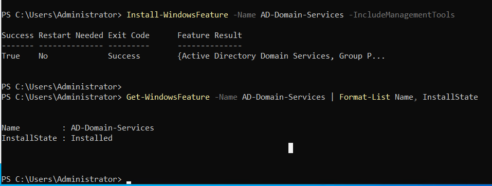

# Part 2 - Active Directory + PowerShell Promotion

> Installing the Active Directory Domain Services (AD DS) role on `DC01`, promoting it to the first Domain Controller in a new forest, and verifying domain health.

**Status:** In progress - AD DS role installed, promotion pending.

---

## Objective

Transform `DC01` from a standalone Windows Server into the first Domain Controller of a new Active Directory forest named `mandolab.local`. After Part 2:

- A new AD forest and domain (`mandolab.local`) exists
- `DC01` hosts AD DS, DNS, and Kerberos KDC services
- The domain database (`NTDS.dit`) and `SYSVOL` share are operational
- Domain-joined clients (added in Part 4) will authenticate against this DC

---

## Lab State Target
+---------------------------------------------------------+
|              Hyper-V Host (Windows 11 Pro)              |
|                                                         |
|  +----------------------+                               |
|  |  DC01                |                               |
|  |  Forest: mandolab.local                              |
|  |  Domain: mandolab.local                              |
|  |  Roles:  AD DS, DNS, KDC                             |
|  |  Static: 10.0.0.10                                   |
|  |  DNS:    127.0.0.1                                   |
|  +----------------------+                               |
|                  Internal vSwitch: LAB-NET              |
+---------------------------------------------------------+

---

## Conceptual Background

### What Active Directory actually is

Active Directory is three things stacked on top of each other:

1. **A specialized database** (`NTDS.dit`) that stores users, computers, groups, group policies, and their attributes.
2. **A protocol stack** that exposes that database over the network: LDAP for queries, Kerberos for authentication, DNS for service discovery, SMB for file replication.
3. **A logical hierarchy** organizing objects into forests, domains, and organizational units (OUs).

### Forest vs Domain vs OU

| Term | What it is | Real-world analogy |
|------|-----------|---------------------|
| **Forest** | The top-level security and replication boundary. All domains in a forest share a common schema and global catalog. | A whole company |
| **Domain** | A namespace inside the forest with its own DCs and replication. | A division or subsidiary |
| **OU** | A container inside a domain used to organize objects and apply Group Policy. | A department |

This lab uses a **single-forest, single-domain** model - the most common configuration in small/mid businesses.

### Why `mandolab.local`

- The lab is fully isolated (no public DNS), so no real domain is required.
- Microsoft historically recommended `.local` for AD; modern guidance prefers a real owned subdomain (`corp.example.com`), but `.local` remains acceptable for isolated labs and is what the majority of small business AD environments still use.
- Renaming a domain post-deployment is painful, so the name was chosen with longevity in mind.

---

## Steps Performed (so far)

### 2.1 - Verify prerequisites

Before installing AD DS, confirmed `DC01` is in the correct baseline state from Part 1: hostname matches, static IP is set, DNS points to loopback.

```powershell
hostname
# DC01

Get-NetIPAddress -InterfaceAlias "Ethernet" -AddressFamily IPv4 |
    Select-Object IPAddress, PrefixLength
# IPAddress  PrefixLength
# ---------  ------------
# 10.0.0.10            24

Get-DnsClientServerAddress -InterfaceAlias "Ethernet" -AddressFamily IPv4 |
    Select-Object ServerAddresses
# ServerAddresses
# ---------------
# {127.0.0.1}
```

A stable hostname, static IP, and self-referential DNS are all hard requirements for AD promotion. Promoting a server with DHCP or a missing DNS pointer fails in confusing ways - it is worth catching here rather than mid-promotion.

---

### 2.2 - Install the AD DS role

In Windows Server, "roles" are major capabilities the OS can take on (file server, web server, Domain Controller, etc.). Installing the **AD-Domain-Services** role adds the binaries and management tools needed to *become* a Domain Controller. It does not promote the server on its own - that is Step 2.3.

```powershell
Install-WindowsFeature -Name AD-Domain-Services -IncludeManagementTools
```

The `-IncludeManagementTools` flag is important. Without it, only the role binaries install - no GUI tools (Active Directory Users and Computers, Active Directory Sites and Services, Group Policy Management Console) and no `ActiveDirectory` PowerShell module. Always install with management tools on a DC.

Verify install:

```powershell
Get-WindowsFeature -Name AD-Domain-Services | Format-List Name, InstallState
# Name         : AD-Domain-Services
# InstallState : Installed
```



The state transitions from `Available` (before) to `Installed` (after). At this point the server has the *capability* to become a DC but has not been promoted - it is still in the workgroup `WORKGROUP`.

---

## What's Next in Part 2

Steps 2.3 onward will be documented after the promotion completes:

- **2.3** - Promote `DC01` to a Domain Controller via `Install-ADDSForest`, creating the `mandolab.local` forest
- **2.4** - Verify domain health (forest functional level, FSMO roles, DNS records, SYSVOL share)
- **2.5** - Confirm administrative login works as `MANDOLAB\Administrator`

---

## Skills Demonstrated (so far)

- AD DS role installation via PowerShell (`Install-WindowsFeature`)
- Pre-promotion validation: hostname, static IP, DNS configuration
- Understanding of role installation vs DC promotion (separate phases)
- Conceptual understanding of forests, domains, and OUs
- Selection of domain naming for an isolated lab environment

---

## What's Next

[Part 3 - AD Users, OUs, and Command Prompt](../part-03-ad-users-cmd/) - Once promotion is complete, populate the domain with organizational units, user accounts, and security groups using both ADUC and PowerShell.