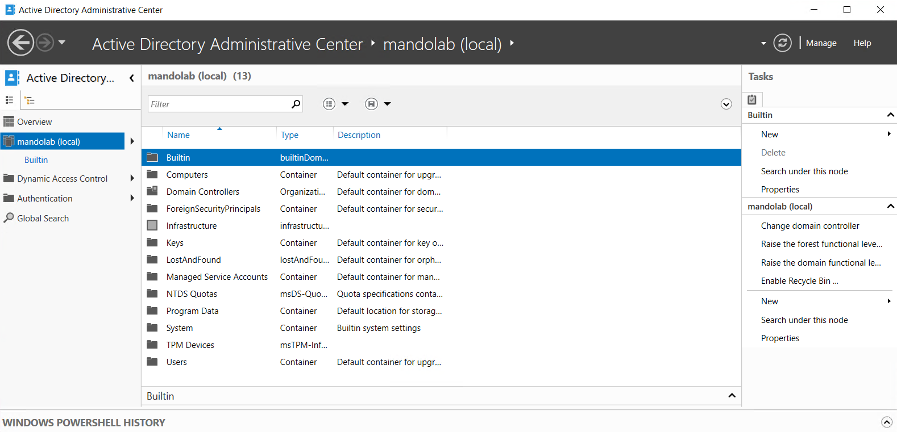
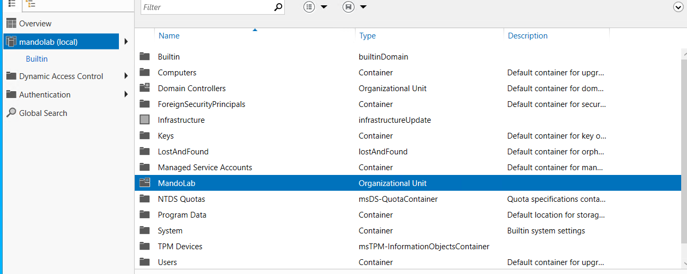
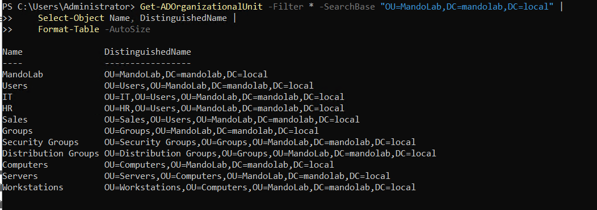
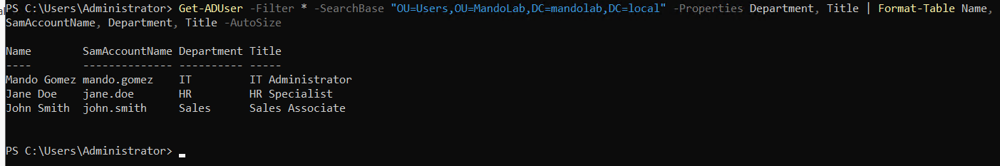
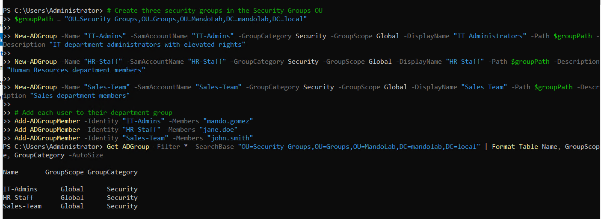
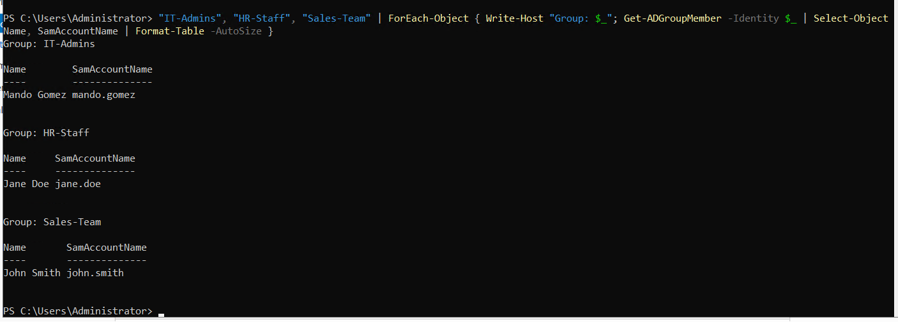

# Part 3 - AD Users, OUs, and Command Prompt

> Building a real organizational structure inside `mandolab.local`: organizational units, user accounts, and security groups - using both the ADUC GUI and PowerShell. These are the day-one tasks every helpdesk technician performs constantly.

**Status:** Complete - 11 OUs, 3 user accounts, 3 security groups created and verified.

---

## Objective

Populate the empty `mandolab.local` domain with the kind of structure a real small business would have. After Part 3:

- An OU hierarchy organizes users, groups, and computers by department/function
- Three user accounts exist with full attributes (department, title, UPN)
- Three security groups represent department membership
- Each user is added to the correct department group
- The domain is ready for a Windows 11 client to be domain-joined (Part 4) and for Group Policy to be applied (Part 5)

---

## OU Structure Built

```
mandolab.local
+-- Builtin                    (default, do not modify)
+-- Computers                  (default container, unused)
+-- Domain Controllers         (auto-created, contains DC01)
+-- ForeignSecurityPrincipals  (default)
+-- Managed Service Accounts   (default)
+-- Users                      (default container, unused)
+-- MandoLab                              <-- Our root OU
    +-- Users
    |   +-- IT
    |   +-- HR
    |   +-- Sales
    +-- Groups
    |   +-- Security Groups
    |   +-- Distribution Groups
    +-- Computers
        +-- Servers
        +-- Workstations
```

**Why a custom root OU instead of using the default `Users` container?** Group Policy cannot be linked directly to the default `Users` or `Computers` containers - those are technically containers, not OUs. Every real AD environment uses a custom OU structure for exactly this reason. Putting all managed objects under a single root OU also makes delegation, backup, and migration simpler.

---

## Conceptual Background

### Why we use groups, not direct user permissions

In AD (and in any directory service), permissions are almost never assigned directly to user accounts. Instead, permissions are assigned to **groups**, and users gain access by being members of the right groups. This is **role-based access control (RBAC)**, and it's the only way that scales.

Imagine an HR department of 50 people accessing a shared file server. With user-based permissions you'd manage 50 ACL entries per resource, multiplied by every shared resource. With group-based permissions, the resource has one ACL entry (`HR-Staff`), and adding/removing employees is just a group membership change.

### Group types and scopes (interview question territory)

Two **categories** in AD:

| Category | Purpose |
|----------|---------|
| Security | Used to assign permissions on resources |
| Distribution | Used as email distribution lists only - cannot grant access |

Three **scopes** that determine where a group can be used and where its members can come from:

| Scope | Can be applied | Members from |
|-------|---------------|--------------|
| Domain Local | Same domain only | Anywhere in the forest |
| **Global** | Any trusted domain | Same domain only |
| Universal | Any domain in forest | Any domain in forest |

For a single-domain environment like this lab, **Global Security** is the correct default. The classic AGDLP best practice (Account -> Global -> Domain Local -> Permission) becomes relevant in multi-domain forests - out of scope here but worth understanding for production.

---

## Steps Performed

### 3.1 - Open Active Directory Users and Computers (ADUC)

ADUC is the GUI tool every helpdesk technician uses for day-to-day AD management: creating users, resetting passwords, modifying group membership. It was installed in Part 2 along with the AD DS role and management tools (`-IncludeManagementTools` flag).

Opened via the Run dialog (`Win+R` -> `dsa.msc`) - the fastest path that every AD admin uses.



The default state shows the auto-created containers: `Builtin`, `Computers`, `Domain Controllers`, `ForeignSecurityPrincipals`, `Managed Service Accounts`, and `Users`. None of these should be modified directly.

---

### 3.2 - Create the root MandoLab OU (GUI)

Right-clicked `mandolab.local` -> New -> Organizational Unit. Named the OU `MandoLab` and left "Protect container from accidental deletion" enabled (default - prevents accidental deletes that would cascade through child objects).

```powershell
# Verify with PowerShell
Get-ADOrganizationalUnit -Filter * | Format-Table Name, DistinguishedName
```

Returned the new OU at `OU=MandoLab,DC=mandolab,DC=local` - the canonical AD path syntax (read right-to-left: domain `mandolab.local`, then OU `MandoLab` inside it).



---

### 3.3 - Build the rest of the OU tree in PowerShell

Creating one OU through the GUI is fine for one-offs, but a real domain has dozens of OUs and constant restructuring. PowerShell scales. The full hierarchy was built in a single block:

```powershell
$root = "OU=MandoLab,DC=mandolab,DC=local"

# Top-level OUs under MandoLab
New-ADOrganizationalUnit -Name "Users" -Path $root
New-ADOrganizationalUnit -Name "Groups" -Path $root
New-ADOrganizationalUnit -Name "Computers" -Path $root

# Sub-OUs under Users
New-ADOrganizationalUnit -Name "IT" -Path "OU=Users,$root"
New-ADOrganizationalUnit -Name "HR" -Path "OU=Users,$root"
New-ADOrganizationalUnit -Name "Sales" -Path "OU=Users,$root"

# Sub-OUs under Groups
New-ADOrganizationalUnit -Name "Security Groups" -Path "OU=Groups,$root"
New-ADOrganizationalUnit -Name "Distribution Groups" -Path "OU=Groups,$root"

# Sub-OUs under Computers
New-ADOrganizationalUnit -Name "Servers" -Path "OU=Computers,$root"
New-ADOrganizationalUnit -Name "Workstations" -Path "OU=Computers,$root"
```

Verified the full structure:

```powershell
Get-ADOrganizationalUnit -Filter * `
    -SearchBase "OU=MandoLab,DC=mandolab,DC=local" |
    Select-Object Name, DistinguishedName |
    Format-Table -AutoSize
```

Output confirmed all 11 OUs (1 root + 3 second-level + 7 third-level), each with the correct nested DN path.



---

### 3.4 - Create user accounts with PowerShell

Three users were created, each in their respective department OU, with realistic attributes:

| User | SamAccountName | UPN | Department | OU |
|------|----------------|-----|------------|-----|
| Mando Gomez | `mando.gomez` | `mando.gomez@mandolab.local` | IT | `OU=IT,OU=Users,OU=MandoLab,...` |
| Jane Doe | `jane.doe` | `jane.doe@mandolab.local` | HR | `OU=HR,OU=Users,OU=MandoLab,...` |
| John Smith | `john.smith` | `john.smith@mandolab.local` | Sales | `OU=Sales,OU=Users,OU=MandoLab,...` |

The pattern shown here (one example - others are identical with their respective values):

```powershell
$labPassword = ConvertTo-SecureString "Welcome2026!" -AsPlainText -Force

New-ADUser `
    -Name "Mando Gomez" `
    -GivenName "Mando" `
    -Surname "Gomez" `
    -SamAccountName "mando.gomez" `
    -UserPrincipalName "mando.gomez@mandolab.local" `
    -DisplayName "Mando Gomez" `
    -Title "IT Administrator" `
    -Department "IT" `
    -Path "OU=IT,OU=Users,OU=MandoLab,DC=mandolab,DC=local" `
    -AccountPassword $labPassword `
    -Enabled $true `
    -ChangePasswordAtLogon $true
```

**Key parameters:**

- `-SamAccountName` - the legacy login name (typed as `MANDOLAB\mando.gomez`)
- `-UserPrincipalName` - modern email-style login (`mando.gomez@mandolab.local`)
- `-AccountPassword` - must be a `SecureString`; converted from plain text in lab context
- `-Enabled $true` - account active immediately (default would be disabled)
- `-ChangePasswordAtLogon $true` - forces a password change on first login (the standard for any new account)

Verified all three users:

```powershell
Get-ADUser -Filter * `
    -SearchBase "OU=Users,OU=MandoLab,DC=mandolab,DC=local" `
    -Properties Department, Title |
    Format-Table Name, SamAccountName, Department, Title -AutoSize
```

Output:
```
Name        SamAccountName Department Title
----        -------------- ---------- -----
Mando Gomez mando.gomez    IT         IT Administrator
Jane Doe    jane.doe       HR         HR Specialist
John Smith  john.smith     Sales      Sales Associate
```



---

### 3.5 - Create security groups and assign membership

Three security groups were created with `Global` scope - the correct choice for a single-domain environment. Each group represents a department's permission set.

```powershell
$groupPath = "OU=Security Groups,OU=Groups,OU=MandoLab,DC=mandolab,DC=local"

New-ADGroup -Name "IT-Admins" `
    -SamAccountName "IT-Admins" `
    -GroupCategory Security `
    -GroupScope Global `
    -DisplayName "IT Administrators" `
    -Path $groupPath `
    -Description "IT department administrators with elevated rights"

New-ADGroup -Name "HR-Staff" `
    -SamAccountName "HR-Staff" `
    -GroupCategory Security `
    -GroupScope Global `
    -DisplayName "HR Staff" `
    -Path $groupPath `
    -Description "Human Resources department members"

New-ADGroup -Name "Sales-Team" `
    -SamAccountName "Sales-Team" `
    -GroupCategory Security `
    -GroupScope Global `
    -DisplayName "Sales Team" `
    -Path $groupPath `
    -Description "Sales department members"
```

Then each user was added to the appropriate group:

```powershell
Add-ADGroupMember -Identity "IT-Admins"  -Members "mando.gomez"
Add-ADGroupMember -Identity "HR-Staff"   -Members "jane.doe"
Add-ADGroupMember -Identity "Sales-Team" -Members "john.smith"
```

Verified group existence:

```powershell
Get-ADGroup -Filter * `
    -SearchBase "OU=Security Groups,OU=Groups,OU=MandoLab,DC=mandolab,DC=local" |
    Format-Table Name, GroupScope, GroupCategory -AutoSize
```

Output:
```
Name       GroupScope GroupCategory
----       ---------- -------------
IT-Admins      Global      Security
HR-Staff       Global      Security
Sales-Team     Global      Security
```



---

### 3.6 - Verify group membership

Confirmed each user landed in the correct group:

```powershell
"IT-Admins", "HR-Staff", "Sales-Team" | ForEach-Object {
    Write-Host "Group: $_"
    Get-ADGroupMember -Identity $_ |
        Select-Object Name, SamAccountName |
        Format-Table -AutoSize
}
```

Output:
```
Group: IT-Admins
Name        SamAccountName
----        --------------
Mando Gomez mando.gomez

Group: HR-Staff
Name     SamAccountName
----     --------------
Jane Doe jane.doe

Group: Sales-Team
Name       SamAccountName
----       --------------
John Smith john.smith
```



This `ForEach-Object` pattern is a useful one-liner for daily AD audits: "show me every member of every group in this OU."

---

## Skills Demonstrated

- OU design and hierarchy planning (single-root pattern with departmental sub-OUs)
- Bulk OU creation via PowerShell (`New-ADOrganizationalUnit`)
- User account provisioning (`New-ADUser`) with full attribute set: department, title, UPN, SamAccountName
- Password handling with `SecureString` (`ConvertTo-SecureString`)
- Forcing password change on first login (`-ChangePasswordAtLogon`)
- Security group creation (`New-ADGroup`) with correct scope (Global) for single-domain
- Group membership management (`Add-ADGroupMember`)
- AD object verification with `Get-ADUser`, `Get-ADGroup`, `Get-ADGroupMember`
- Understanding of Distinguished Name (DN) syntax and OU paths
- Conceptual fluency with group scopes (Domain Local / Global / Universal) and categories (Security / Distribution)
- Use of both ADUC GUI and PowerShell - the practical reality of helpdesk work

---

## What's Next

[Part 4 - Windows 11 Domain Join](../part-04-windows11-domain-join/) - Create a Windows 11 Pro client VM, give it a static IP on `LAB-NET`, join it to `mandolab.local`, and log in as `MANDOLAB\jane.doe`. The first end-to-end proof that the domain actually works.
